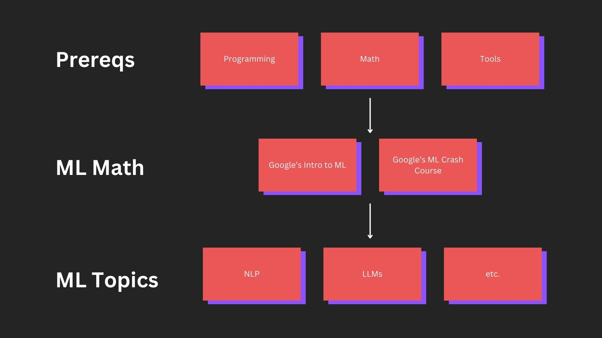

# Machine Learning Road Map

Welcome to the **Machine Learning Road Map**. This is the fastest, high-quality road map to get up to speed on machine learning fundamentals. It teaches you the prerequisites and machine learning fundamentals necessary to understand how machine learning works and build with it. The goal is to quickly get to a point where you can comfortably explore machine learning topics on your own. Many other road maps are more comprehensive, this one is purposefully streamlined.

These resources are aggregated from the best ML educators. I've linked to the authors as much as possible. Please support them. **Feedback/suggestions/corrections** are always welcome and appreciated.

If you're less interested in the technical details of machine learning and want to know more about how machine learning will affect you as a consumer, [I've written an article just for that](https://societysbackend.com/p/ml-is-bananas). You can also check out the [Google AI Essentials Course](https://www.coursera.org/google-learn/ai-essentials/?action=enroll&utm_campaign=sou--google__med--blog__cam--ai-launch__geo--US__con--kw&utm_medium=institutions&utm_source=google) learn how to use generative AI to boost your productivity.

**This road map will be updated as new learning resources are created and new ML topics emerge.** Let's get started!

_If you're looking for the previous road map, you can find it [here](road_maps/old_road_map/README.md)._

___

- [Machine Learning Road Map](#machine-learning-road-map)
  - [Things to Know Before You Begin](#things-to-know-before-you-begin)
  - [Machine Learning Prerequisites](#machine-learning-prerequisites)
  - [Machine Learning Fundamentals](#machine-learning-fundamentals)
  - [Advanced ML Topics](#advanced-ml-topics)
  - [Job Skills and Where to Learn Them \[WIP\]](#job-skills-and-where-to-learn-them-wip)
  - [Newsletters, Blogs, and Channels for Machine Learning](#newsletters-blogs-and-channels-for-machine-learning)
  - [Free GPUs for Training](#free-gpus-for-training)
  - [Support This Guide](#support-this-guide)

## Things to Know Before You Begin

* **Machine Learning will impact everyone's life.** It's a new paradigm of computing that will completely change the way consumers expect their devices to work.
* **Machine learning is a rapidly developing field.** There are many complex fields within machine learning. Take it slow and don't expect to become an expert in it all.
* **The best way to understand machine learning is to learn from others who understand the topics you want to know more about.** I've created a list of [accounts to follow on X](https://x.com/i/lists/1738669706595258373). I've also aggregated [a list of newsletters, blogs, and channels](#newsletters-blogs-and-channels-for-machine-learning) I find helpful to stay updated.

## Machine Learning Prerequisites

These prerequisites contain a mixture of math and programming concepts. Feel free to skip things you already understand.

| Topic | Source | Author 
|---|---|---|
| **Programming** |
| General Programming  | [CS50](https://cs50.harvard.edu/x/2024/weeks/0/) | Harvard
| Python | [Intro to Python (For Beginners)](https://cs50.harvard.edu/python/2022/) | Harvard
|| [Google's Python Class (Refresher)](https://developers.google.com/edu/python) | Google
| NumPy | [NumPy Tutorial](https://colab.research.google.com/github/google/eng-edu/blob/main/ml/cc/exercises/numpy_ultraquick_tutorial.ipynb?utm_source=mlcc&utm_campaign=colab-external&utm_medium=referral&utm_content=mlcc-prework&hl=en) | Google
| Pandas | [Pandas Course](https://www.kaggle.com/learn/pandas) | Kaggle
| **Math** |
| Algebra | [Algebra Curriculum](https://www.khanacademy.org/math/algebra-home) | Khan Academy
| Linear Algebra | [Linear Algebra Curriculum](https://www.khanacademy.org/math/linear-algebra) | Khan Academy
| Probability | [Uncertainty Section of CS50](https://cs50.harvard.edu/ai/2024/weeks/2/) | Harvard
| Calculus | [Derivatives/Partial Derivatives](https://www.khanacademy.org/math/multivariable-calculus/multivariable-derivatives) | Khan Academy
|| [Gradients](https://www.khanacademy.org/math/multivariable-calculus/multivariable-derivatives/gradient-and-directional-derivatives/v/gradient) | Khan Academy
|| [Backpropagation Visualization](https://developers-dot-devsite-v2-prod.appspot.com/machine-learning/crash-course/backprop-scroll/) | Google
| **Tools** |
| Version Control | [Learn How to Use Git](https://git-scm.com/book/en/v2) | Open Source Git Community
|| [Github Tutorial](https://docs.github.com/en/get-started) | GitHub
| Terminal | [Learn Shell](https://www.learnshell.org/#:~:text=instructions.%20Good%20luck!-,Learn%20the%20Basics,-Hello%2C%20World!) | learnshell.org

## Machine Learning Fundamentals

This is the main material. Complete these to understand machine learning fundamentals:

| Topic | Source | Author
|---|---|---|
| Intro | [20 Min Introduction to Machine Learning](https://developers.google.com/machine-learning/intro-to-ml) | Google
| Fundamentals | [Machine Learning Crash Course](https://developers.google.com/machine-learning/crash-course/framing/video-lecture) | Google

## Advanced ML Topics

High-quality resources to explore more advanced topics that are helpful for machine learning:

| Topic | Source | Author | Type
|---|---|---|---|
| General Advanced ML Topics | [Machine Learning Q and AI](https://www.amazon.com/Machine-Learning-AI-Essential-Questions/dp/1718503768/ref=sr_1_1?crid=N6POWOVAERX9&dib=eyJ2IjoiMSJ9.4oCd5DaBraiVbzZDag-sX4dJQTIguc2mCbDGm1UCKmsheh9rvOwOn-KIy2upiHKjMFGLiI77lOadkVrSY2gib7Dv5VVJHjkw9-AgmiMoUVwI1s8aUrRs8w7GP4KwiAdgkBYkwfszGqb1wvaqjrZeH9_r3UFIl3HwyNmC7ZCwxQMo1vpjPnWUEo7IC8ryYAAYvPQtgZjDdYGTQ0hUeZPBcB2k6xw1ZLciOjkUpBugNXGOZS1-MUwxxIC70bjzfuNt6O-UuEPpo2AxeE3vRWEhDeaFO4pm7W2JHpw-xmUl5I4.drw9Rw29o6HojRSkner-QP-anoCMTWvtocpOzPXWpa0&dib_tag=se&keywords=machine+learning+q+and+ai&qid=1718026169&sprefix=machine+learning+q+and+a%2Caps%2C117&sr=8-1) | [Sebastian Raschka](https://x.com/rasbt) | Book
| Large Language Models | [Intro to LLMs](https://www.youtube.com/watch?v=zjkBMFhNj_g) | [Andrej Karpathy](https://x.com/karpathy) | Video
|| [Developing, Building, and Fine-tuning a LLM](https://www.youtube.com/watch?v=kPGTx4wcm_w) | [Sebastian Raschka](https://x.com/rasbt) | Video
|| [Build a Large Language Model (From Scratch)](https://github.com/rasbt/LLMs-from-scratch) | [Sebastian Raschka](https://x.com/rasbt) | Book/Repo
|| [Quantization Section of LLM Course](https://github.com/mlabonne/llm-course?tab=readme-ov-file#quantization) | [Maxime Labonne](https://x.com/maximelabonne)| Course/Repo
|| [LLM Tools](https://github.com/mlabonne/llm-course?tab=readme-ov-file#tools) | [Maxime Labonne](https://x.com/maximelabonne)| Course/Repo
|| [LLM Engineering](https://github.com/mlabonne/llm-course?tab=readme-ov-file#-the-llm-engineer) | [Maxime Labonne](https://x.com/maximelabonne)| Course/Repo
|| [LLM Engineer's Handbook](https://www.amazon.com/dp/1836200072?ref=cm_sw_r_cp_ud_dp_ZFR4XZPT7EY41ZE1M5X9&ref_=cm_sw_r_cp_ud_dp_ZFR4XZPT7EY41ZE1M5X9&social_share=cm_sw_r_cp_ud_dp_ZFR4XZPT7EY41ZE1M5X9) | Paul Iusztin, Maxime Labonne, Alex Vesa | Book
| Generative AI | [Generative AI For Beginners](https://github.com/microsoft/generative-ai-for-beginners) | [Microsoft](https://www.microsoft.com/en-us/ai) | Course/Repo
| Natural Language Processing (NLP) | [NLP Course](https://huggingface.co/learn/nlp-course/chapter1/1) | [Huggingface](https://huggingface.co/learn) | Course
| Transformers | [Start of NLP Course](https://huggingface.co/learn/nlp-course/chapter1/1) | [Huggingface](https://huggingface.co/learn) | Course
| Deep Learning | [Deep Learning Fundamentals](https://lightning.ai/courses/deep-learning-fundamentals/) | [LightningAI](https://lightning.ai) | Course
| | [Deep Learning Book](https://www.deeplearningbook.org/) | Ian Goodfellow and Yoshua Bengio and Aaron Courville | Book
| | [The Engineer's Guide To Deep Learning](https://www.interdb.jp/dl/index.html) | [Hironobu Suzuki](https://x.com/suzuki_hironobu) | Book
| Reinforcement Learning (RL) | [Spinning Up](https://spinningup.openai.com/en/latest/) | [OpenAI](https://openai.com) | Course 
| Computer Vision | [Computer Vision](https://www.kaggle.com/learn/computer-vision) | [Kaggle](https://kaggle.com/learn) | Course
| Unsupervised Learning | [Second Half of CS229](CS229/lecture_14.md) | [Andrew Ng/Stanford](https://x.com/AndrewYNg) | Lecture
| Supervised Learning | [Supervised Machine Learning for Science](https://ml-science-book.com/) | Christoph Molnar & Timo Freiesleben | Book
| ML for Video Games | [Machine Learning for Games](https://huggingface.co/learn/ml-games-course/unit0/introduction) | [Huggingface](https://huggingface.co/learn) | Course
| Feature Engineering | [Data Prep](https://developers.google.com/machine-learning/data-prep/?utm_source=mlcc&utm_campaign=mlcc-next-steps&utm_medium=referral&utm_content=data-prep-ss) | [Google](https://developers.google.com/) | Course
| AI Ethics | [Intro to AI Ethics](https://www.kaggle.com/learn/intro-to-ai-ethics) | [Kaggle](https://kaggle.com/learn) | Course
| ML Explainability | [Machine Learning Explainability](https://www.kaggle.com/learn/machine-learning-explainability) | [Kaggle](https://kaggle.com/learn) | Course
| ML Ops | [Made with ML](https://madewithml.com/) | [Goku Mohandas](https://x.com/GokuMohandas) | Course
| Virtual Classroom for Building LLMs | [ML School](https://www.ml.school/) | [Santiago](https://x.com/svpino) | Interactive Course
| More Python | [The Python Coding Place](https://thepythoncodingplace.com/) | [Stephen Gruppetta](https://x.com/s_gruppetta_ct) | Website/Book
| SQL | [Intro to SQL](https://www.kaggle.com/learn/intro-to-sql) | [Kaggle](https://kaggle.com/learn) | Course
|| [Advanced SQL](https://www.kaggle.com/learn/advanced-sql) | [Kaggle](https://kaggle.com/learn) | Course
| Studying for ML Interviews | [Study Plan for ML Interviews](https://github.com/khangich/machine-learning-interview) | [Khang Pham](https://twitter.com/KhangAnPham) | Repo
| Machine Learning Math | [Mathematics of Machine Learning](https://tivadar.gumroad.com/l/mathematics-of-machine-learning?wanted=true&referrer=https%3A%2F%2Ftivadardanka.com%2Fabout-me)| [Tivadar Danka](https://twitter.com/tivadardanka) | Book
| Machine Learning Efficiency | [EfficientML.ai Lecture](https://www.youtube.com/playlist?list=PL80kAHvQbh-pT4lCkDT53zT8DKmhE0idB)| [MIT](https://hanlab.mit.edu/courses/2023-fall-65940) | Course
| Knowledge Distillation | [Awesome Knowledge Distillation](https://github.com/dkozlov/awesome-knowledge-distillation)| [Dmitry Kozlov](https://github.com/dkozlov) | Repo
| System Design | System Design Interview [Volume 1](https://www.amazon.com/System-Design-Interview-insiders-Second/dp/B08CMF2CQF/ref=sr_1_1?crid=JX9PXJDACSPE&dib=eyJ2IjoiMSJ9.CZwZ7txhICEtME2JuLCqj9Bkde4opffmKt_uE1rHfEIb7jRrLFvGUvKYqbsiljVkHZSb--1a1bUA9raXIXcpqtTPeg4W9Gp5ORApDkf4yGj_PINh3CLAEqn270KmROrZOn7bjeNHjjCWXl0h91GFWnn-TV9Oj8my3oaE2AZqCEnOe5O7khcpiLe3or1cdxkJWdZiAPmcDhBqZkk0Xd-zCbH_BHXcOAuM_GF5HUIF1Ug.dcEt6jC3UduxTXFiZ8zAHcMtoPv4yi1KEuB6fVNmhBA&dib_tag=se&keywords=system+design+alex+xu&qid=1721701289&sprefix=system+design+alex+%2Caps%2C106&sr=8-1) and [Volume 2](https://www.amazon.com/System-Design-Interview-Insiders-Guide/dp/1736049119/ref=sr_1_2_sspa?crid=JX9PXJDACSPE&dib=eyJ2IjoiMSJ9.CZwZ7txhICEtME2JuLCqj9Bkde4opffmKt_uE1rHfEIb7jRrLFvGUvKYqbsiljVkHZSb--1a1bUA9raXIXcpqtTPeg4W9Gp5ORApDkf4yGj_PINh3CLAEqn270KmROrZOn7bjeNHjjCWXl0h91GFWnn-TV9Oj8my3oaE2AZqCEnOe5O7khcpiLe3or1cdxkJWdZiAPmcDhBqZkk0Xd-zCbH_BHXcOAuM_GF5HUIF1Ug.dcEt6jC3UduxTXFiZ8zAHcMtoPv4yi1KEuB6fVNmhBA&dib_tag=se&keywords=system+design+alex+xu&qid=1721701289&sprefix=system+design+alex+%2Caps%2C106&sr=8-2-spons&sp_csd=d2lkZ2V0TmFtZT1zcF9hdGY&psc=1)| [Alex Xu](https://twitter.com/alexxubyte) | Book

## Job Skills and Where to Learn Them [WIP]

This section contains the technologies and skills I find most often as I go through real machine learning-related job descriptions and the resources for learning each.

| Topic | Source | Author
|---|---|---|
| Tensorflow | Coming Soon | Coming Soon
| PyTorch | Coming Soon | Coming Soon
| Scikit-learn | Coming Soon | Coming Soon
| Keras | Coming Soon | Coming Soon
| NumPy | Coming Soon | Coming Soon
| Pandas | Coming Soon | Coming Soon
| SQL | Coming Soon | Coming Soon
| Python | Coming Soon | Coming Soon
| C++ | Coming Soon | Coming Soon
| Rust | Coming Soon | Coming Soon
| JAX | Coming Soon | Coming Soon
| Linear Algebra | Coming Soon | Coming Soon
| Calculus | Coming Soon | Coming Soon
| Deep Learning | Coming Soon | Coming Soon
| Computer Vision | Coming Soon | Coming Soon
| Natural Language Processing | Coming Soon | Coming Soon
| ONNX | Coming Soon | Coming Soon
| TensorRT | Coming Soon | Coming Soon
| LangChain | Coming Soon | Coming Soon
| AWS | Coming Soon | Coming Soon
| Azure | Coming Soon | Coming Soon
| GCP | Coming Soon | Coming Soon
| XGBoost | Coming Soon | Coming Soon
| Transformers | Coming Soon | Coming Soon
| Cuda | Coming Soon | Coming Soon
| Java | Coming Soon | Coming Soon
| LLMs | Coming Soon | Coming Soon
| RAG | Coming Soon | Coming Soon
| Kubernetes | Coming Soon | Coming Soon
| Docker | Coming Soon | Coming Soon

## Newsletters, Blogs, and Channels for Machine Learning

All of these are must-subscribes:

| Resource | Author
|---|---|
| **Blogs/Newsletters** |
| [Ahead of AI](https://magazine.sebastianraschka.com/)  | [Sebastian Raschka](https://x.com/rasbt)
| [AI Made Simple](https://artificialintelligencemadesimple.substack.com/)  | [Devansh](https://x.com/Machine01776819)
| [Society's Backend](https://societysbackend.com)  | [Logan Thorneloe](https://x.com/loganthorneloe)
| [The Batch](https://www.deeplearning.ai/the-batch/)  | [Andrew Ng](https://x.com/andrewyng)
| [Interconnects](https://www.interconnects.ai/)  | [Nathan Lambert](https://x.com/natolambert)
| [Deep (Learning) Focus](https://cameronrwolfe.substack.com/)  | [Cameron R. Wolfe](https://twitter.com/cwolferesearch)
| [ML Spring](https://mlspring.beehiiv.com/)  | [Akshay Pachaar](https://twitter.com/akshay_pachaar)
| [Spatial Intelligence](https://www.spatialintelligence.ai/)  | [Bilawal Sidhu](https://twitter.com/bilawalsidhu)
| [The AIEdge](https://newsletter.theaiedge.io/)  | [Damien Benveniste](https://x.com/DamiBenveniste)
| [Google DeepMind Blog](https://deepmind.google/discover/blog/)  | Multiple
| [OpenAI Blog](https://openai.com/news/)  | Multiple
| [Meta AI Blog](https://ai.meta.com/blog/?page=1)  | Multiple
| [QiuByte](https://hesamsheikh.substack.com/) | [Hesam Sheikh](https://x.com/itsHesamSheikh)
| [NLP Newsletter](https://nlp.elvissaravia.com/) | [Elvis](https://x.com/omarsar0)
| [The Palindrome](https://thepalindrome.org/) | [Tivadar Danka](https://twitter.com/tivadardanka)
| **YouTube** |
| [Andrej Karpathy](https://www.youtube.com/@AndrejKarpathy) | [Andrej Karpathy](https://twitter.com/karpathy)
| [Spatial Intelligence](https://www.youtube.com/@bilawal) | [Bilawal Sidhu](https://twitter.com/bilawalsidhu)
| [Jay Alammar](https://www.youtube.com/@arp_ai) | [Jay Alammar](https://twitter.com/JayAlammar)
| [Mervin Praison](https://www.youtube.com/@MervinPraison) | [Mervin Praison](https://x.com/MervinPraison)
| [Nicholas Renotte](https://www.youtube.com/@NicholasRenotte) | [Nicholas Renotte](https://x.com/nicholasrenotte)
| [Jeremy Howard](https://www.youtube.com/@howardjeremyp) | [Jeremy Howard](https://x.com/jeremyphoward)
| [Logan Thorneloe](https://www.youtube.com/@loganthorneloe) | [Logan Thorneloe](https://x.com/loganthorneloe)
| [3Blue1Brown](https://www.youtube.com/@3blue1brown) | [Grant Sanderson](https://x.com/3blue1brown)
| [RohanPaulAI](https://www.youtube.com/@RohanPaul-AI) | [Rohan Paul](https://x.com/rohanpaul_ai)

For a list of **almost all** the available ML YouTube Courses check out [this repo by Dair AI](https://github.com/dair-ai/ML-YouTube-Courses).

## Free GPUs for Training

I've aggregated a list of cloud providers that offer a free tier for training machine learning models. Anyone can get started with ML- you don't need a powerful local machine. If anything is incorrect, [reach out to me on X](https://x.com/loganthorneloe) so I can make the fix. If there is a cloud computing platform that I've missed, also let me know.

| Resource | Details
|---|---|
| **Top Choices** |
| [Google Colab](https://colab.google/) | Offers free access to GPUs (usually NVIDIA T4 or P100) and TPUs with limited usage time and resources. Excellent for small projects and experimentation.
| [Kaggle Notebooks](https://www.kaggle.com/code) | Provides 30 hours/week of GPU usage (NVIDIA Tesla P100 or T4) for free. It's a good option with access to Kaggle's datasets and community.
| **Other Options** |
| [Lightning AI](https://lightning.ai/) | Offers one free studio with 22 GPU hours and is pay-as-you-go after that.
| [Google Cloud Platform](https://cloud.google.com/gpu) | Offers $300 in free credits to new users.
| [Amazon SageMaker](https://aws.amazon.com/machine-learning/accelerate-machine-learning-P3/) | Provides a free tier with limited access to various machine learning resources.
| [Paperspace Gradient](https://www.paperspace.com/notebooks) | Offers a free community tier with access to limited GPU resources for experimentation and learning.

## Support This Guide

Don't forget to star this repo and [follow me on X](https://x.com/loganthorneloe) to support this guide. **Please support the authors of these resources by following them at the links I included.** You can also find them in my [ML on X](https://x.com/i/lists/1738669706595258373) list.

If any information is missing, you are the author of a resource and you'd like it removed, or any other general feedback [send me a message](https://x.com/loganthorneloe) to let me know.