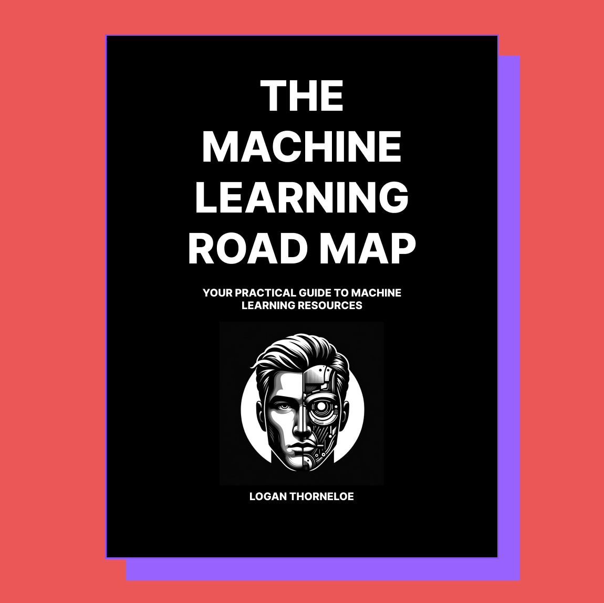

# The Machine Learning Road Map

**This guide will take you from whatever your current machine learning knowledge is to a basic understanding of machine learning principles using high-quality, free resources**.

There are many great machine learning resources on the internet, but the field is complex and growing so quickly it requires a resource just to navigate those resources. This guide serves this purpose.

This guide will always be free. You can support it by starring this repo and [following me on X](https://twitter.com/loganthorneloe) so I can share it with more people.

## Before You Begin
Understand the following:
* **Everyone needs an understanding of AI.** Even consumers will have to know how the technology they use affects their life. I'll include different road maps for the different levels of knowledge. I've written more in-depth about this [here](https://societysbackend.com/p/ai-isnt-an-option).
* **Take your time.** Machine learning is a complex field that is growing quickly. Don't rush the learning process. It will always be a good time to learn about AI.
* **Your greatest learning resource is people.** Very few people have a good grasp on all AI topics. The best way to learn about AI is from people who know about it and are sharing their knowledge. I've included [a list of people to follow and newsletters to subscribe to](others.md) for this purpose.
* **AI is a work in progress.** Even the most well-known AI researchers are trying to understand how AI will affect humanity. Don't automatically assume something someone is saying is truth, learn from many different people, and check sources.

## Road Maps
Here are the 5 different paths to learning about machine learning this road map covers. If you think there are other paths of learning that I've missed, let me know.

* [**I'm a consumer and I want to know how ML will affect me.**](road_maps/consumer_road_map.md) ML will fundamentally change the way consumers interact with their devices. They need to understand this interaction to know the privacy and safety implications of this change. This road map is simple and will help you understand that.
* [**I want to learn how to develop ML models and get into AI research.**](road_maps/modeling_road_map.md) Machine learning math is the primary and most important skill for this along with a coding background. This road map is more intense and will take you through these skills.
* [**I want to learn the skills necessary for an ML engineer.**](road_maps/mle_road_map.md) A strong software development background with a ML math understanding is required to solve the problems ML engineers tackle. This road map is more intense and will take you through these skills.
* [**I'm a dev who wants to build applications using ML.**](road_maps/dev_road_map.md) The emergence of LLMs has led a lot of developers to become interested in how ML can be used in their apps. This road map will help you understand this.
* [**My company wants to use AI and I don't know how to get started.**](road_maps/company_road_map.md) Every company can benefit from the use of AI but how this happens is determined by the problems that company is trying to solve and the data they have available.

## Support this guide

Don't forget to star this repo and [following me on X](https://x.com/loganthorneloe) to support this guide.

In order to comply with X Shopping's terms of service, this road map is also available in paperback. It'll cost as I'll have to send a print out of it to you. You can [contact me for this on X](https://x.com/loganthorneloe).
